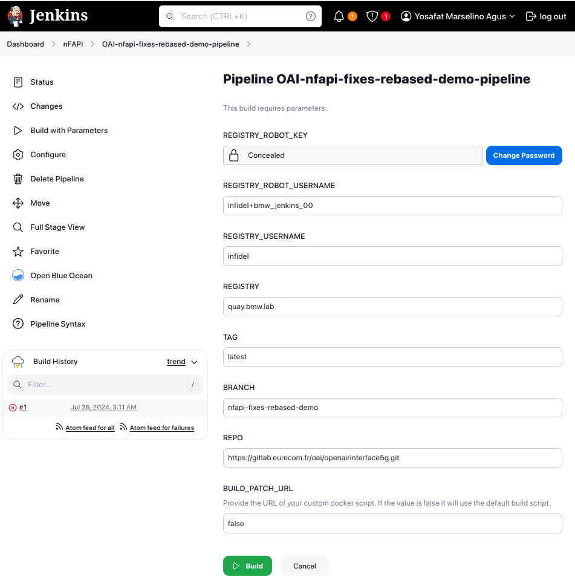

# Build Patches

## Jenkins Pipeline

Pipeline scripts to automate the build process.

- `REGISTRY`: Image registry where you put your docker images.
- `REGISTRY_USERNAME`:  Username for the image registry.
- `REGISTRY_ROBOT_USERNAME`: Robot account for the image registry.
- `REGISTRY_KEY`: Robot account token for the image registry
- `TAG`: Image tag.
- `BRANCH`: Repository branch that you want to build.
- `BUILD_PATCH`: default value will be`false` provide URL to your custom script to override it.
- `REPO` : Code repository of the project.

## Dockerfile  

Overwrite dockerfile used to build OAI or OSC.
