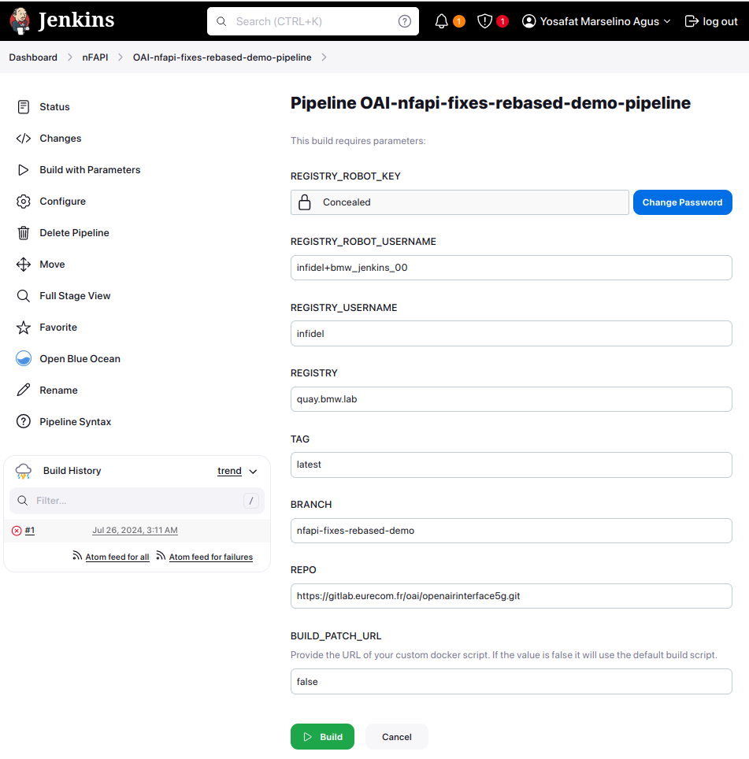

# Jenkins Pipeline

## Pipeline on Regular Jenkins Agent

Pipeline scripts to automate the build process.

- `REGISTRY`: Image registry where you put your docker images.
- `REGISTRY_USERNAME`:  Username for the image registry.
- `REGISTRY_ROBOT_USERNAME`: Robot account for the image registry.
- `REGISTRY_KEY`: Robot account token for the image registry
- `TAG`: Image tag.
- `BRANCH`: Repository branch that you want to build.
- `BUILD_PATCH`: default value will be`false` provide URL to your custom script to override it.
- `REPO` : Code repository of the project.



## Dockerfile (Patches)

- Overwrite dockerfile used to build OAI or OSC.
- Modify existing dockerfiles available on the repo.

## Jenkins Pipeline

- Build pipelines


## Pipeline on K8S Jenkins Agent

- This is insance, we can build images from kubernetes pod.
- This kind of implementation are located at

```
#O1 Build
./jenkins/o1/jenkinsfile.oai.k8s.base-build-gnb 

#SMO Testing
./jenkins/smo/jenkinsfile.smo-test 
```


